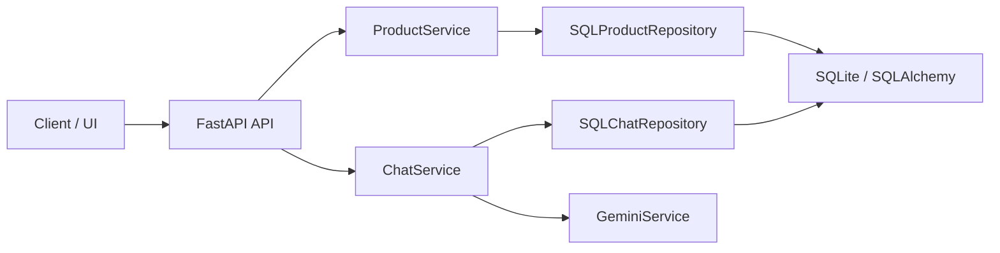

# E-Commerce Chat AI

Proyecto de e-commerce con chatbot de IA para recomendación de productos y gestión de inventario.

## Características principales

- API REST con FastAPI para productos y chat
- Persistencia con SQLite y SQLAlchemy
- Servicio de chat conversacional con Google Gemini
- Repositorios y capa de aplicación para separación de responsabilidades
- Docker y Docker Compose para desarrollo y despliegue
- Pruebas unitarias con pytest

## Arquitectura

La aplicación sigue una arquitectura en capas:

- `src/domain`: entidades de negocio, excepciones e interfaces de repositorio
- `src/application`: servicios de aplicación y DTOs
- `src/infrastructure`: implementación de repositorios, API, base de datos e integración con Gemini



## Instalación

```bash
python -m venv .venv
source .venv/bin/activate  # Windows: .venv\Scripts\activate
pip install -r requirements.txt
```

## Configuración

Crea un archivo `.env` en la raíz del proyecto con al menos estas variables:

```env
GEMINI_API_KEY=tu_api_key
DATABASE_URL=sqlite:///./data/ecommerce_chat.db
```

## Uso

### Ejecutar localmente

```bash
uvicorn src.infrastructure.api.main:app --host 0.0.0.0 --port 8000
```

### Endpoints principales

- `GET /` - Información básica de la API
- `GET /products` - Lista todos los productos
- `GET /products/{product_id}` - Obtiene un producto por ID
- `POST /chat` - Envía un mensaje al chat de IA
- `GET /chat/history/{session_id}` - Obtiene historial de una sesión
- `DELETE /chat/history/{session_id}` - Elimina historial de sesión
- `GET /health` - Health check

### Ejemplo de solicitud de chat

```bash
curl -X POST http://localhost:8000/chat \
  -H "Content-Type: application/json" \
  -d '{"session_id": "sess1", "message": "Quiero zapatillas de running"}'
```

## Testing

Ejecuta las pruebas unitarias con:

```bash
pytest
```

## Docker

### Construir imagen

```bash
docker build -t ecommerce-chat-ai .
```

### Ejecutar con Docker Compose

```bash
docker-compose up --build
```

## Tecnologías utilizadas

- Python 3.11
- FastAPI
- SQLAlchemy
- SQLite
- Pydantic
- google.generativeai
- Docker / Docker Compose
- pytest

## Estructura del proyecto

```text
Dockerfile
README.md
docker-compose.yml
pyproject.toml
requirements.txt
src/
  application/
    product_service.py
    chat_service.py
    dtos.py
  domain/
    entities.py
    exceptions.py
    repositories.py
  infrastructure/
    api/
      main.py
    db/
      database.py
      init_data.py
      models.py
    llm_providers/
      gemini_service.py
    repositories/
      product_repository.py
      chat_repository.py
tests/
  test_entities.py
  test_services.py
```
